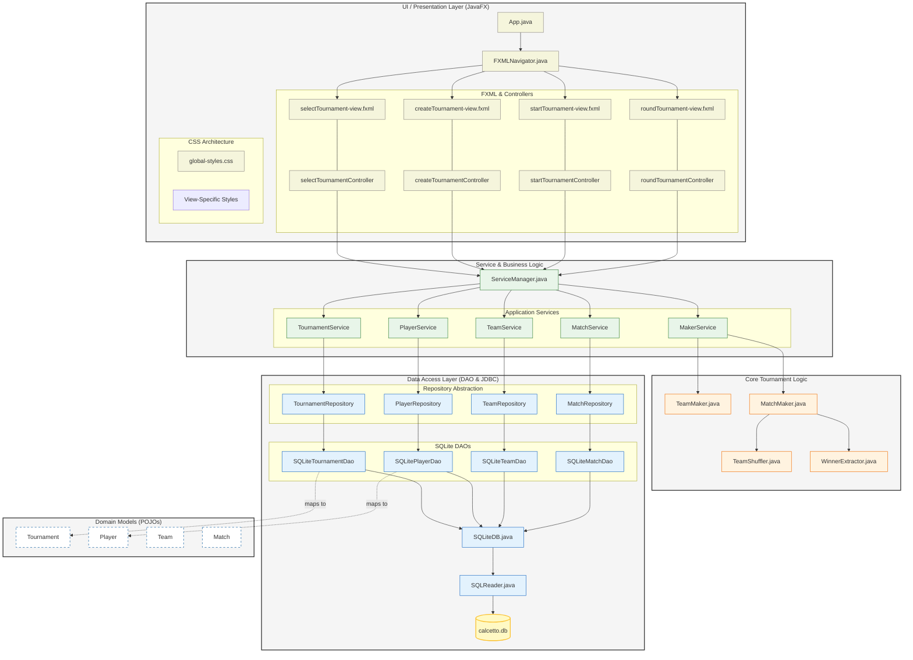
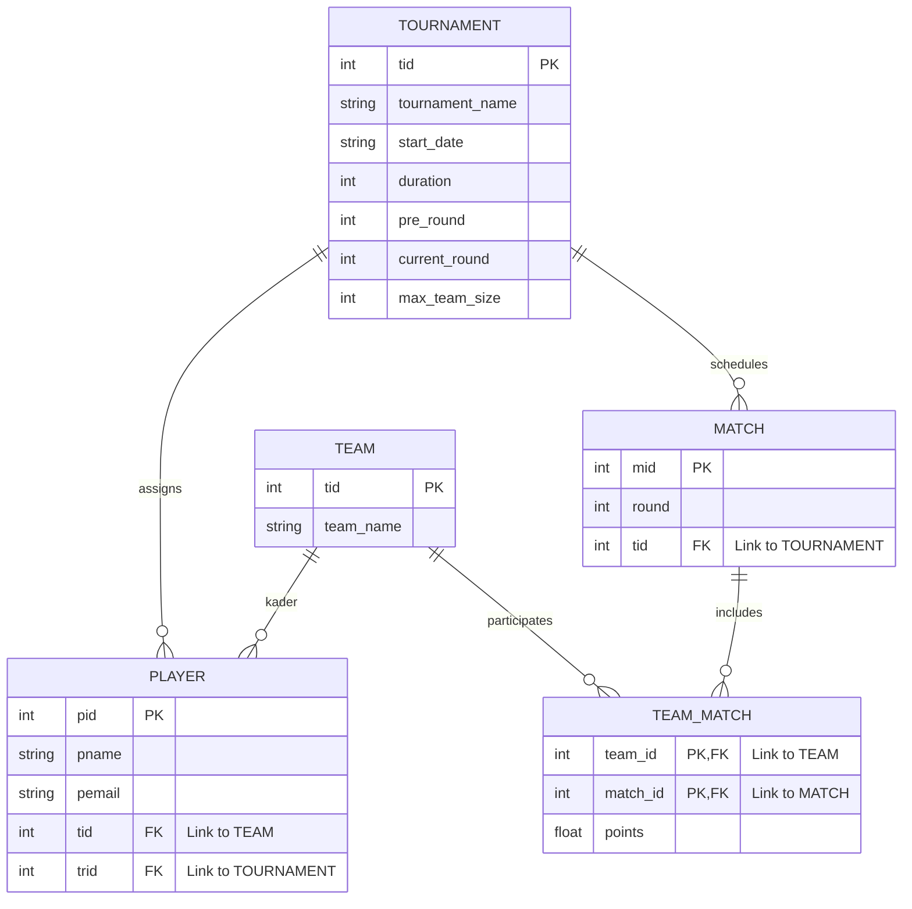

# Calcetto Management System

A professional JavaFX-based desktop application designed to manage tournaments efficiently. The system handles everything from tournament creation and player registration to automated team generation and match scheduling.

## Features

- **Tournament Management**: Create and track multiple tournaments with specific durations and rules.
- **Player & Team Management**: Register players and automatically generate balanced teams.
- **Automated Matchmaking**: Intelligent algorithms for creating match pairings and managing tournament rounds.
- **Score Tracking**: Real-time point updates and leaderboard management.
- **Modern UI/UX**: Clean, responsive interface built with JavaFX and modular CSS.
- **Persistent Storage**: Robust data management using SQLite and JDBC.

## Tech Stack

- **Language**: Java 21+
- **UI Framework**: JavaFX 21
- **Database**: SQLite with JDBC
- **Build Tool**: Maven
- **Libraries**:
  - `SQLite-JDBC` for database connectivity.
  - `JavaFaker` for Randomly generating Team Names

## Project Structure

```textsrc/main/
src/main/
├── java/ ... /calcettomanagmentsystem/
│   ├── core/
│   │   ├── connection/
│   │   ├── dao/
│   │   │   └── impl/
│   │   ├── model/
│   │   └── repo/
│   │       └── impl/
│   ├── service/
│   │   └── management/
│   └── ui/
│       ├── components/
│       ├── controller/
│       │   ├── components/
│       │   ├── modal/
│       │   └── view/
│       └── modal/
│
└── resources/ ... /calcettomanagmentsystem/
    ├── config/
    ├── css/
    │   ├── components/
    │   ├── modal/
    │   └── view/
    ├── fxml/
    │   ├── components/
    │   ├── modal/
    │   └── view/
    └── schemas/
```

## Project Layers



## DB Notation



## Installation

### Prerequisites
- JDK 21 or higher
- Maven 3.8+

### Steps
1. **Clone the repository**:
   ```bash
   git clone https://github.com/alex1009-system32/CalcettoManagementSystem.git
   cd CalcettoManagementSystem
   ```

2. **Build the project**:
   ```bash
   mvn clean install
   ```

3. **Run the application**:
   ```bash
   mvn javafx:run
   ```

## Usage

1. **Start Application**: Launch the app via the main class `App.java`.
2. **Create Tournament**: Navigate to "Create Tournament", enter the name, start date, and max team size.
3. **Add Players**: Register players for the active tournament.
4. **Generate Teams**: Use the automated shuffler to create balanced teams.
5. **Manage Matches**: Start the tournament to generate the first round of matches and record results.
